
DESIGN · ENGINEERING · DELIVERY

<h1 align="center">Jottysng</h1>

<strong>Full Stack Developer</strong> &nbsp;·&nbsp; Santiago Cárdenas Jotty

  

<em>Ideas claras. Código útil. Experiencias que importan.</em> Clear ideas. Useful code. Experiences that matter.

  <picture>
    <source media="(prefers-color-scheme: dark)" srcset="./dark_mode.svg" />
    <source media="(prefers-color-scheme: light)" srcset="./light_mode.svg" />
    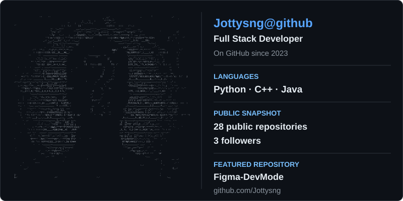
  </picture>

---

<h2 align="center">👨‍💻 About Me</h2>

Soy desarrollador full stack. Me interesa convertir ideas en productos web claros, rápidos y mantenibles. I build web products that are clear, fast, and maintainable.

<h2 align="center">⚡ Currently</h2>

Diseñando interfaces · conectando frontend y backend · afinando despliegues Building interfaces · connecting systems · improving delivery

---

<h2 align="center">🛠️ Tech Stack</h2>

Herramientas con las que trabajo y exploro · Tools I use and explore

<strong>Languages & Markup</strong>

  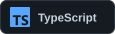
  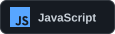
  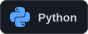
  
  
  
  
  
  
  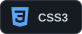
  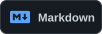

<strong>Frontend & Runtime</strong>

  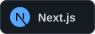
  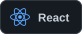
  
  
  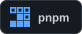

<strong>Backend & Data</strong>

  
  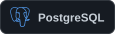
  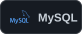
  
  
  

<strong>Data Science & AI</strong>

  
  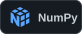
  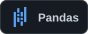
  
  
  
  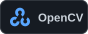

<strong>Systems & Delivery</strong>

  
  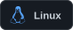
  
  
  
  
  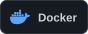
  
  
  

<strong>Workflow & Editors</strong>

  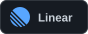
  
  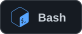
  
  
  
  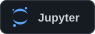
  
  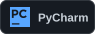

---

<h2 align="center">🚀 Featured Projects</h2>

  <a href="https://github.com/Jottysng/JottyPortfolio">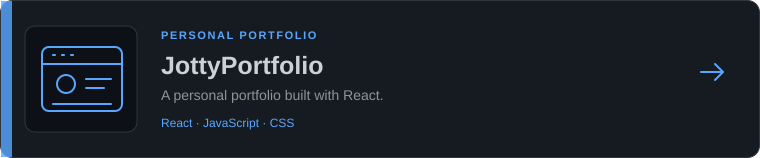</a> 
  <a href="https://jotty-portfolio.vercel.app">Live demo ↗</a> &nbsp;·&nbsp; <a href="https://github.com/Jottysng/JottyPortfolio">Source ↗</a>

  <a href="https://github.com/Jottysng/frontend-todo">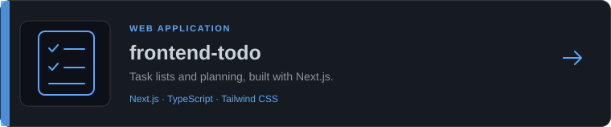</a> 
  <a href="https://frontend-todo-gilt.vercel.app">Live demo ↗</a> &nbsp;·&nbsp; <a href="https://github.com/Jottysng/frontend-todo">Source ↗</a>

  <a href="https://github.com/Jottysng/Figma-DevMode">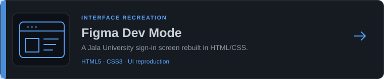</a> 
  <a href="https://github.com/Jottysng/Figma-DevMode">Explore repository ↗</a>

---

<h2 align="center">📊 GitHub Stats & Activity Pulse</h2>

Lenguajes y repositorios · eventos públicos de los últimos 30 días Languages and repositories · public events from the last 30 days

---

<h2 align="center">🏆 Achievements</h2>

Portfolio público y aplicaciones web desplegadas · proyectos abiertos que abarcan frontend, backend y diseño. Public builds across frontend, backend, and interface design.

<h2 align="center">🎯 Goals</h2>

Crear productos full stack fiables, profundizar en arquitectura backend y cloud, y aportar a proyectos abiertos. Build reliable products, deepen backend and cloud skills, contribute to open source.

---

<h2 align="center">🤝 Contact</h2>

  <a href="https://github.com/Jottysng">GitHub</a> &nbsp;·&nbsp;
  <a href="https://www.linkedin.com/in/santiago-c%C3%A1rdenas-jotty-6a93ba360/">LinkedIn</a> &nbsp;·&nbsp;
  <a href="mailto:santiagocardenas432@gmail.com">Email</a> &nbsp;·&nbsp;
  <a href="http://jottyportfolio-s8bjqi-258c2b-161-153-45-177.sslip.io/es/">Portfolio</a>

Built with intention · Hecho con intención Icon artwork: <a href="https://simpleicons.org">Simple Icons</a>, <a href="https://devicon.dev">Devicon</a> and <a href="https://tabler.io/icons">Tabler Icons</a>.

